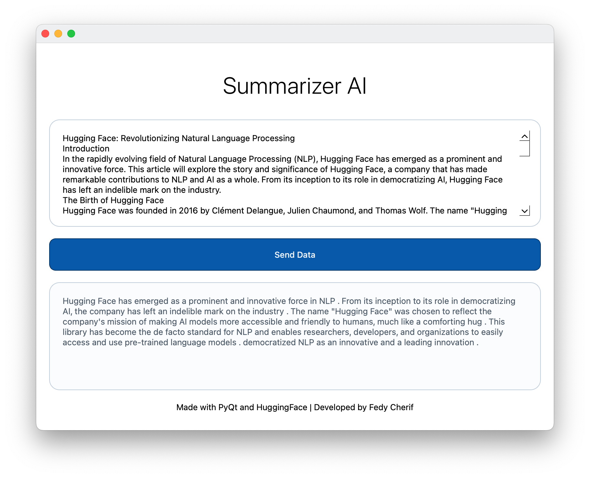

# SummarizerAI-Qt

This is a functional prototype of a desktop app written in PyQt that uses the generative pre-trained transformers from HuggingFace to summarize text data.

* *Note: This experimental project is a basic functional version of a HuggingFace model and you can modify the project to use another model from HuggingFace .*

## How to run:

You will need python version 3.7 or higher and pip installed on your computer to be able to run this project. Visit [python.org/downloads](https://www.python.org/downloads/) if you don't already have python installed.

To run the desktop application type the following command into the terminal.

```sh
python app.py
```

* *Note: You might have to use `python3` instead if your computer doesn't have `python`.*

### Dependencies:

The external dependencies needed for this project is the `transformer` package from [HuggingFace](https://huggingface.co/docs/transformers/en/installation) in order to use their models, and the `pyside6` for the [Qt](https://doc.qt.io/qtforpython-6/quickstart.html) user interface. 

```sh
pip install 'transformers[torch]'
pip install pyside6
```

* *Note: You might have to use `pip3` instead if your computer doesn't have `pip`. The `[torch]` tag is added for the torch machine learning framework.*

This specific project uses the model named [`facebook/bart-large-cnn`](https://huggingface.co/facebook/bart-large-cnn) to summarize the text data that is sent from the web page.

* *Note: The model is installed when `app.py` runs (this model is approximately 1.6 GB).*

## How to use:

When you run the application, it will begin by installing the HuggingFace summarization model for the app. Once it completed the installation it will open an application window.

Once opened you can write text in the text box, then click send data which sends to the server and returns the summarized version.

* *Note: There is a limit of 8192 characters as more will cause very long load times. You can however change the source code to include a higher range.*

## Project Structure:

The source code of this project is composed of 2 files:

* `app.py`: The script that handles the user interface and the HuggingFace model.
* `style.qss`: This is for the look of the application.

### Code Description:

In the `app.py` file, there is a class named `SummarizerAI` that inherits the properties of `QWidget` to have it as the central user interface of the app.

#### HuggingFace:

The summarization model is handled by a single function called `HuggingFaceSummarizer` that is taken from the `pipeline` provided by the `transformers` dependency.

```python
result = HuggingFaceSummarizer(ARTICLE, max_length=8192, min_length=128, do_sample=False)
```

* *Note: You can change to a different model however you might have to modify certain portions of `HuggingFaceSummarizer` to get it to work.*

## Screenshots:



The above is an image of the application.

## Sources:

Here are the following technologies used:

- [HuggingFace](https://huggingface.co/docs/transformers/en/installation): HuggingFace was used to get the text summarization AI to work.
- [Qt for Python](https://doc.qt.io/qtforpython-6/): The User Interface framework used for the application to render the data.
